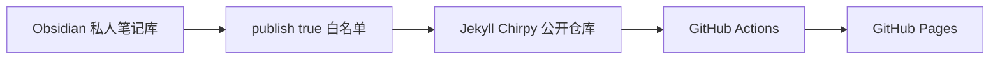

这篇文章记录本博客从私人 Obsidian 笔记库到公开网站的完整搭建过程。目标很明确：不维护服务器，不引入数据库，只公开主动筛选过的文章，并尽量把长期成本控制在零。

> **公开边界**
> 私人笔记库始终是内容源。公开仓库只包含标记为可发布的文章和文章实际引用的附件，不包含项目记录、原始资料、账号凭据或未公开的安全研究内容。

## 最终架构



这个结构把写作、筛选、构建和托管分开。即使公开仓库出现配置错误，完整私人笔记也不会被直接推送到 GitHub。

## 开发环境

搭建时使用 Windows 10，并提前安装以下工具：

```powershell
git --version
gh --version
node --version
npm --version
```

站点使用 Chirpy 7.6 主题。日常写作只需要 Obsidian、Git 和 PowerShell；Jekyll 构建由 GitHub Actions 中固定的 Ruby 3.4 环境完成，本机不需要常驻服务。

## 创建公开仓库

公开仓库使用 GitHub 用户站点的命名方式：

```text
TJT001/TJT001.github.io
```

这样部署后的地址直接是：

```text
https://TJT001.github.io
```

仓库从 Chirpy 官方 `chirpy-starter` 创建，并在独立目录中维护。它不会放进私人 Obsidian Vault，也不会把整个 Vault 当作网站内容目录。

## 为什么选择 Chirpy

Chirpy 是面向技术写作的 Jekyll 主题，默认提供固定侧边栏、文章摘要列表、分类、标签、归档、全文搜索、代码高亮、目录和明暗模式。页面结构清晰，阅读体验接近传统技术博客，也不需要自行维护前端应用。

## 只发布明确公开的文章

需要公开的笔记在 frontmatter 中加入：

```yaml
publish: true
draft: false
```

发布采用双重限制：

1. 只扫描允许公开的知识领域目录。
2. 只复制明确包含 `publish: true` 的文章。

新建文章模板默认使用 `publish: false` 和 `draft: true`。这意味着“忘记修改状态”的结果是不发布，而不是意外公开。

## 图片和附件

图片继续放在文章目录下，而不是集中放入全局附件目录：

```text
文章目录/
├─ 文章.md
├─ 截图.png
└─ 流程图.webp
```

发布时只复制文章实际引用的同目录附件。这样一篇文章可以连同图片整体移动或导出，也能避免把同目录之外的原始材料带到公开仓库。

## 自动构建和部署

GitHub Actions 在每次推送后执行以下流程：

```text
安装 Ruby 3.4
→ Bundler 安装 Chirpy 依赖
→ Jekyll 构建静态文件
→ 上传 GitHub Pages
```

博客本身是静态网站，没有服务器进程、数据库和后台管理系统。GitHub Pages 提供托管和 HTTPS，因此当前固定成本为零。

## 日常发布流程

后续发布文章只需要完成以下步骤：

1. 在 Obsidian 中写完文章并检查公开边界。
2. 将文章设置为 `publish: true`、`draft: false`。
3. 运行导出脚本，确认待发布文件列表。
4. 检查生成的 Chirpy 文章和附件路径。
5. 提交并推送公开仓库。
6. 等待 GitHub Actions 完成部署。

如果文章链接到私人笔记、引用不存在的图片或包含明显的凭据格式，导出过程会停止，而不是带着错误继续发布。

## 稳定性和成本

这套方案没有常驻服务，故障面主要集中在依赖升级和构建配置。为减少变化：

- GitHub Actions 的 Ruby 版本固定。
- Chirpy 主题限制在 7.6 系列。
- 内容发布与主题升级分开进行。
- 每次发布都保留 Git 提交历史，出现问题时可以回退。
- 大型视频和压缩包不直接放入博客仓库。

对个人技术博客而言，这种方式已经覆盖写作、分类、标签、搜索、归档、版本记录和自动部署，同时保持较低的维护成本。

## 小结

本博客的核心不是把整个笔记库搬到公网，而是建立一条可控的发布通道：私人内容默认留在本地，成品文章经过检查后才进入公开仓库。本文就是这条发布链路的第一篇实际内容。
